# UI/Core Separation TODO

Version target: 2.0

## Goal

Separate responsibilities so the UI layer only:

- Renders state already prepared for display.
- Shows/hides panels, labels, buttons, warnings, and controls.
- Emits explicit user commands when the player clicks, toggles, drags, or presses hotkeys.
- Refreshes visual controls after the application state changes.

The UI layer should not:

- Query low-level game managers directly for gameplay decisions.
- Mutate disaster models directly.
- Save/load settings directly.
- Stop, reset, spawn, unlock, or modify disasters directly.
- Contain simulation algorithms, targeting logic, disaster cleanup logic, or dependency detection logic.
- Know how `Services.DisasterSetup`, `Services.DisasterHandler`, `Services.Disasters`, `Services.Vehicles`,
  `Services.Water`, `Services.Terrain`, or base-game managers must be manipulated.

## Current Coupling To Remove

### Core/handler depends on UI

- `Source/Handlers/NaturalDisasterHandler.cs`
  - Imports `NaturalDisastersRenewal.UI` and `NaturalDisastersRenewal.UI.ComponentHelper`.
  - Stores UI component references:
    - `InGameDisastersPanel dPanel`
    - `ShelterHoverDebugOverlay shelterHoverDebugOverlay`
    - `UIButton toggleButton`
  - Creates UI objects directly in `CreateExtendedDisasterPanel`.
  - Updates UI visibility and position directly.
  - Checks `ModSettingsScreen.IsCapturingHotkey` before handling hotkeys.

- `Source/BaseGameExtensions/LoadingExtension.cs`
  - Imports `NaturalDisastersRenewal.UI`.
  - Calls `ModSettingsScreen.UpdateUISettingsOptions()` directly during level load.

### UI depends on core/simulation details

- `Source/UI/InGameDisastersPanel.cs`
  - Reads `Services.DisasterHandler.container.AllDisasters` directly.
  - Toggles disaster models directly in `ToggleDisasterState`.
  - Calls `Services.DisasterSetup.<Disaster>.SetEnabled` directly.
  - Calls `ModSettingsScreen.UpdateUISettingsOptions()` directly.
  - Implements `StopAllDisasters`, including direct access to:
    - `Services.Vehicles`
    - `Services.Water`
    - `Services.Terrain.WaterSimulation`
    - `Services.Disasters`
    - `Services.DisasterHandler.GetDisasterWrapper`
    - `Services.DisasterHandler.container.ActiveDisasters`

- `Source/UI/ModSettingsScreen.cs`
  - Reads `Services.DisasterSetup` directly.
  - Mutates `DisasterSetupModel` properties directly from UI callbacks.
  - Calls `Services.DisasterSetup.Save()` directly.
  - Calls `Services.DisasterHandler.ReadValuesFromFile()`.
  - Calls `Services.DisasterHandler.ResetToDefaultValues()`.
  - Calls `Services.DisasterHandler.UpdateDisastersDPanel()`.
  - Calls `Services.DisasterHandler.UpdateDisastersPanelToggleBtn()`.
  - Calls `DisasterExtension.SetDisableDisasterFocus` directly.

- `Source/UI/ShelterHoverDebugOverlay.cs`
  - Performs shelter hit testing and shelter state analysis.
  - Queries buildings, terrain, disasters, simulation frame, water depth, and meteor impact data directly.
  - Mixes debug-data calculation with visual label rendering.

## Target Architecture

Use a simple staged structure, not a large framework rewrite.

### Proposed Dependency Flow

```mermaid
flowchart TB
    Player["Player input<br/>clicks, hotkeys, settings changes"]

    subgraph UI["UI layer - Source/UI"]
        ModSettingsScreen["ModSettingsScreen<br/>renders settings controls"]
        InGamePanel["InGameDisastersPanel<br/>renders disaster status"]
        DisasterRow["DisasterRowHelper<br/>renders one disaster row"]
        ShelterOverlay["ShelterHoverDebugOverlay<br/>renders debug overlay"]
        UiManager["DisasterPanelUiManager<br/>creates and positions UI"]
    end

    subgraph App["Application/control layer - Source/Application"]
        SettingsController["DisasterSettingsController<br/>settings commands"]
        PanelController["DisasterPanelController<br/>panel view-model builder"]
        CommandService["DisasterCommandService<br/>disaster commands"]
        ShelterProvider["ShelterDebugInfoProvider<br/>debug data provider"]
        UiRefresh["IUiRefreshService<br/>refresh boundary"]
        HotkeyState["HotkeyCaptureState<br/>input capture boundary"]
    end

    subgraph ViewModels["UI-ready view models"]
        SettingsVM["SettingsViewModel"]
        PanelVM["DisasterPanelViewModel"]
        RowVM["DisasterRowViewModel"]
        ShelterVM["ShelterDebugInfoViewModel"]
    end

    subgraph Core["Domain/core layer"]
        Handler["NaturalDisasterHandler<br/>domain orchestration"]
        Setup["DisasterSetupModel<br/>settings state"]
        DisasterModels["DisasterBaseModel + concrete disasters<br/>probability, intensity, lifecycle"]
        Compatibility["ModCompatibilityService<br/>mod detection"]
        SimulationUtils["DisasterSimulationUtils<br/>shared calculations"]
        Serialization["Serialization<br/>save/load data"]
    end

    subgraph Game["Cities: Skylines / Unity APIs"]
        Managers["Game managers<br/>Simulation, Disasters, Buildings, Terrain, Vehicles, Water"]
        GameUI["ColossalFramework.UI<br/>UIPanel, UIButton, UILabel"]
        Harmony["Harmony patches<br/>base-game behavior hooks"]
    end

    Player --> UI

    ModSettingsScreen --> SettingsController
    InGamePanel --> CommandService
    ShelterOverlay --> ShelterProvider
    UiManager --> GameUI

    SettingsController --> SettingsVM
    PanelController --> PanelVM
    PanelVM --> RowVM
    ShelterProvider --> ShelterVM

    SettingsVM --> ModSettingsScreen
    PanelVM --> InGamePanel
    RowVM --> DisasterRow
    ShelterVM --> ShelterOverlay

    SettingsController --> Setup
    SettingsController --> Handler
    CommandService --> Handler
    CommandService --> DisasterModels
    CommandService --> Managers
    PanelController --> Setup
    PanelController --> DisasterModels
    PanelController --> Compatibility
    ShelterProvider --> Managers
    UiRefresh --> UI
    HotkeyState --> ModSettingsScreen

    Handler --> Setup
    Handler --> DisasterModels
    Handler --> Serialization
    DisasterModels --> SimulationUtils
    DisasterModels --> Managers
    Compatibility --> Managers
    Serialization --> Setup
    Harmony --> Handler

    classDef ui fill:#dbeafe,stroke:#2563eb,color:#111827
    classDef app fill:#dcfce7,stroke:#16a34a,color:#111827
    classDef vm fill:#fef3c7,stroke:#d97706,color:#111827
    classDef core fill:#f3e8ff,stroke:#9333ea,color:#111827
    classDef game fill:#fee2e2,stroke:#dc2626,color:#111827

    class ModSettingsScreen,InGamePanel,DisasterRow,ShelterOverlay,UiManager ui
    class SettingsController,PanelController,CommandService,ShelterProvider,UiRefresh,HotkeyState app
    class SettingsVM,PanelVM,RowVM,ShelterVM vm
    class Handler,Setup,DisasterModels,Compatibility,SimulationUtils,Serialization core
    class Managers,GameUI,Harmony game
```



The intended direction is one-way for normal UI workflows:

- UI emits commands to the application layer.
- Application services mutate core state or read core state.
- Application services build view models.
- UI renders view models.
- Core does not instantiate or call concrete UI classes.

### UI layer

Files under `Source/UI` should contain:

- UI component creation.
- Layout and styling.
- Event binding.
- Rendering from view models.
- Forwarding player actions as commands.

Allowed dependencies:

- View model classes designed for UI consumption.
- Command interfaces or application services.
- Localization and UI styling helpers.
- Game UI APIs such as `ColossalFramework.UI`, where needed.

Disallowed dependencies:

- Direct mutation of `DisasterSetupModel` outside narrowly controlled binding code during transition.
- Direct calls to `Services.Vehicles`, `Services.Water`, `Services.Terrain`, `Services.Disasters`,
  `Services.Buildings`, or similar simulation managers.
- Direct disaster cleanup, unlock, spawn, reset, stop, targeting, or persistence logic.

### Application/control layer

Add a small layer that receives UI commands and coordinates domain services.

Suggested namespace:

- `NaturalDisastersRenewal.Application`

Suggested files:

- `Source/Application/DisasterPanelController.cs`
- `Source/Application/DisasterSettingsController.cs`
- `Source/Application/DisasterCommandService.cs`
- `Source/Application/ShelterDebugInfoProvider.cs`
- `Source/Application/ViewModels/DisasterPanelViewModel.cs`
- `Source/Application/ViewModels/DisasterRowViewModel.cs`
- `Source/Application/ViewModels/SettingsViewModel.cs`
- `Source/Application/ViewModels/ShelterDebugInfoViewModel.cs`

Responsibilities:

- Convert domain state into UI-ready view models.
- Own commands such as enable/disable disaster, stop all disasters, reset progress, save settings,
  reset settings, refresh localization, and update panel visibility preferences.
- Hide direct `Services.*` usage from UI.
- Coordinate existing model and handler classes without forcing a full rewrite.

### Domain/core layer

Core classes should contain:

- Disaster probability/intensity logic.
- Disaster lifecycle logic.
- Unlock logic.
- Persistence decisions.
- Settings state and validation.
- Base-game manager interactions needed for simulation.

Core should not:

- Instantiate `UIPanel`, `UIButton`, `UILabel`, or any UI component.
- Know about `ModSettingsScreen`, `InGameDisastersPanel`, or `ShelterHoverDebugOverlay`.
- Call UI refresh methods directly.

## Staged Refactor Plan

### Stage 1: Extract disaster commands from `InGameDisastersPanel`

Goal:

- Remove gameplay processing from the in-game panel.
- Keep visible behavior unchanged.

Create:

- `Source/Application/DisasterCommandService.cs`

Move or wrap:

- `StopAllDisasters`
- Reset all disaster progress.
- Toggle one disaster enabled/disabled.
- Clear active disaster tracking.

Proposed public methods:

- `ToggleDisasterEnabled(DisasterType disasterType)`
- `StopAllDisasters()`
- `ResetAllDisasterProgress()`
- `GetDisasterRows()`

UI changes:

- `InGameDisastersPanel.ToggleDisasterState` should call `DisasterCommandService.ToggleDisasterEnabled`.
- `StopAllDisastersBtn_eventClick` should call `DisasterCommandService.StopAllDisasters`.
- `ResetAllDisastersBtn_eventClick` should call `DisasterCommandService.StopAllDisasters` and
  `DisasterCommandService.ResetAllDisasterProgress`.
- The panel should refresh using returned state or a view model, not by reading global containers directly.

Acceptance criteria:

- No direct use of `Services.Vehicles`, `Services.Water`, `Services.Terrain`, or `Services.Disasters`
  remains in `InGameDisastersPanel`.
- `InGameDisastersPanel` does not clear `ActiveDisasters` directly.
- `InGameDisastersPanel` does not switch over `DisasterType` to mutate `Services.DisasterSetup`.
- Existing stop/reset/toggle behavior still works in game.

### Stage 2: Introduce panel view models

Goal:

- UI receives a prepared display model instead of pulling data from the domain model.

Create:

- `Source/Application/ViewModels/DisasterPanelViewModel.cs`
- `Source/Application/ViewModels/DisasterRowViewModel.cs`
- `Source/Application/DisasterPanelController.cs`

`DisasterRowViewModel` should include UI-ready values such as:

- `DisasterType Type`
- `string DisplayName`
- `bool Enabled`
- `bool Unlocked`
- `float ProbabilityProgress`
- `float MaxIntensityProgress`
- `string ProbabilityTooltip`
- `string IntensityTooltip`
- `string StatusTooltip`
- `string[] MeteorPeriodLabels`
- Any warning state needed for display.

`DisasterPanelViewModel` should include:

- Rows.
- Population threshold label text.
- Dependency status labels.
- Whether the panel button should be visible.
- Whether the panel should be visible.
- Localized title/header strings if this reduces UI logic.

UI changes:

- `InGameDisastersPanel` should build rows from `DisasterPanelViewModel.Rows`.
- `DisasterRowHelper` should initialize from `DisasterRowViewModel`, not directly from `DisasterBaseModel`.
- Refresh should ask `DisasterPanelController.BuildViewModel()`.

Acceptance criteria:

- `InGameDisastersPanel` no longer reads `Services.DisasterHandler.container.AllDisasters` directly.
- `DisasterRowHelper` does not need `DisasterBaseModel` for display.
- Refreshing the panel is a pure render pass from a view model.

### Stage 3: Move UI creation out of `NaturalDisasterHandler`

Goal:

- Core handler no longer owns UI component creation or component references.

Create:

- `Source/UI/DisasterPanelUiManager.cs`

Responsibilities:

- Create `InGameDisastersPanel`.
- Create the toggle `UIButton`.
- Create `ShelterHoverDebugOverlay`.
- Bind click, drag, hotkey-display, and visibility events.
- Expose UI-level methods:
  - `Create()`
  - `Refresh()`
  - `SetPanelVisible(bool visible)`
  - `SetToggleButtonVisible(bool visible)`
  - `UpdateToggleButtonIcon()`
  - `ApplySavedPositions()`
  - `ResetPanelPosition()`
  - `ResetToggleButtonPosition()`

`NaturalDisasterHandler` changes:

- Remove fields:
  - `InGameDisastersPanel dPanel`
  - `ShelterHoverDebugOverlay shelterHoverDebugOverlay`
  - `UIButton toggleButton`
- Replace direct UI logic with calls to a UI manager or application event.
- Keep non-UI responsibilities only:
  - Load/reset settings.
  - Apply Harmony patches.
  - Own domain container while transitional architecture remains.
  - Check unlocks.
  - Redefine base-game disaster max intensity if still appropriate.

`LoadingExtension` changes:

- Stop importing `NaturalDisastersRenewal.UI`.
- Replace direct `ModSettingsScreen.UpdateUISettingsOptions()` with an application-level refresh command,
  or trigger UI refresh through a UI manager registered at startup.

Acceptance criteria:

- `NaturalDisasterHandler.cs` has no `using NaturalDisastersRenewal.UI`.
- `NaturalDisasterHandler.cs` has no `using ColossalFramework.UI` unless still needed for non-UI base-game API.
- `NaturalDisasterHandler.cs` does not instantiate `GameObject` for UI components.
- `LoadingExtension.cs` does not call `ModSettingsScreen` directly.

### Stage 4: Separate settings commands from `ModSettingsScreen`

Goal:

- Settings UI should render controls and dispatch setting changes.
- It should not decide how settings are persisted, reset, or applied to simulation.

Create:

- `Source/Application/DisasterSettingsController.cs`
- `Source/Application/ViewModels/SettingsViewModel.cs`

Proposed controller methods:

- `BuildSettingsViewModel()`
- `SetLanguage(ModLanguage language)`
- `SetDisableDisasterFocus(bool value)`
- `SetPauseOnDisasterStarts(bool value)`
- `SetPartialEvacuationRadius(float value)`
- `SetMaxPopulationToTriggerHigherDisasters(float value)`
- `SetScaleMaxIntensityWithPopulation(bool value)`
- `SetAllowExtremeIntensities(bool value)`
- `SetRecordDisasterEvents(bool value)`
- `SetShowDisasterPanelButton(bool value)`
- `SetTogglePanelHotkey(KeyCode key, EventModifiers modifiers)`
- `ClearTogglePanelHotkey()`
- `SaveDefaults()`
- `ReloadSavedSettings()`
- `ResetToDefaultSettings()`
- `ResetToggleButtonPosition()`
- `ResetPanelPosition()`

UI changes:

- `BuildSaveFooter` should call controller methods, not `Services.DisasterSetup.Save()` or
  `Services.DisasterHandler.ResetToDefaultValues()`.
- UI callbacks should call controller setters.
- Controller should perform any related side effects:
  - Refresh localized UI after language changes.
  - Apply `DisasterExtension.SetDisableDisasterFocus`.
  - Refresh disaster panel after relevant setting changes.
  - Persist settings.

Acceptance criteria:

- `ModSettingsScreen` no longer calls `Services.DisasterSetup.Save()` directly.
- `ModSettingsScreen` no longer calls `Services.DisasterHandler.ReadValuesFromFile()` directly.
- `ModSettingsScreen` no longer calls `Services.DisasterHandler.ResetToDefaultValues()` directly.
- `ModSettingsScreen` no longer calls `DisasterExtension.SetDisableDisasterFocus()` directly.
- UI callback bodies become small and mostly one-line command dispatches.

### Stage 5: Extract shelter debug data calculation

Goal:

- Debug overlay renders debug info only.
- Data calculation happens outside UI.

Create:

- `Source/Application/ShelterDebugInfoProvider.cs`
- `Source/Application/ViewModels/ShelterDebugInfoViewModel.cs`

`ShelterDebugInfoProvider` responsibilities:

- Determine hovered shelter.
- Resolve shelter building data.
- Determine street segment flood state.
- Determine water depth.
- Determine nearby meteor water impact info.
- Return null/no result when nothing should be displayed.

`ShelterDebugInfoViewModel` should include:

- `ushort ShelterId`
- `bool StreetKnown`
- `bool IsFlooded`
- `ushort SegmentId`
- `float WaterDepth`
- `string MeteorImpactText`
- `Vector3 WorldPosition`
- `string DisplayText`

UI changes:

- `ShelterHoverDebugOverlay.Update` should ask the provider for info.
- Overlay should only:
  - Set label text.
  - Size itself from label dimensions.
  - Convert world position to GUI position.
  - Toggle visibility.

Acceptance criteria:

- `ShelterHoverDebugOverlay` no longer directly reads `Services.Buildings`, `Services.Disasters`,
  `Services.Simulation`, or `Services.Terrain`.
- Most methods named `TryGet...` move out of the UI class.
- The overlay becomes easy to disable/remove without affecting simulation logic.

### Stage 6: Add a UI refresh boundary

Goal:

- Core/application code can request UI refresh without knowing concrete UI classes.

Create one of these simple options:

- Option A: `IUiRefreshService`
  - `RefreshSettings()`
  - `RefreshDisasterPanel()`
  - `RefreshAll()`

- Option B: application events
  - `SettingsChanged`
  - `DisasterPanelStateChanged`
  - `LocalizationChanged`
  - `PanelVisibilityChanged`

Recommended first step:

- Use a simple service/interface before introducing events. It is easier to reason about in this codebase.

Acceptance criteria:

- Core/application code does not call `ModSettingsScreen.UpdateUISettingsOptions()` directly.
- Core/application code does not call `InGameDisastersPanel.Refresh()` directly.
- UI refresh can be invoked from one narrow boundary.

### Stage 7: Reduce global `Services` usage in UI

Goal:

- `Services` remains available to core/application services, but UI stops reaching into it.

Process:

- Run `rg -n "Services\\." Source\\UI`.
- For each hit, decide whether it belongs in:
  - a command service,
  - a view-model builder,
  - a debug-info provider,
  - a compatibility/dependency status provider,
  - or a UI manager.

Acceptance criteria:

- `rg -n "Services\\." Source\\UI` returns zero or only narrowly justified exceptions.
- Every exception is documented with a short comment explaining why UI must access it directly.

### Stage 8: Reduce cross-UI static calls

Goal:

- UI components should not coordinate each other through static methods when an application/UI manager can own coordination.

Targets:

- `ModSettingsScreen.UpdateUISettingsOptions()`
- `ModSettingsScreen.IsCapturingHotkey`
- `InGameDisastersPanel` calling `ModSettingsScreen`
- `NaturalDisasterHandler` checking `ModSettingsScreen`

Preferred replacements:

- `HotkeyCaptureState` service for key capture status.
- `IUiRefreshService.RefreshSettings()`.
- `DisasterPanelUiManager.Refresh()`.

Acceptance criteria:

- `rg -n "ModSettingsScreen\\." Source` should show UI-owned creation/update only, not core checks.
- Hotkey handling depends on an input/capture service, not on a concrete settings screen.

### Stage 9: Define Testing Strategy After Structure Stabilizes

Goal:

- Define the testing strategy only after the UI/core separation is mostly complete, so tests target stable
  responsibilities instead of locking in the current mixed architecture.

Timing rule:

- Do not invest heavily in formal automated tests while `Source/UI` still owns domain mutations or while
  `NaturalDisasterHandler` still owns concrete UI components.
- During stages 1-8, use focused manual checks and build verification to avoid double work.
- Start the full testing strategy after the command/controller/view-model boundaries are in place.

Create:

- `Source/Versions/FutureWork/TestingStrategyTODO.md`

Testing strategy topics to define:

- What can be unit tested without Cities: Skylines runtime.
- What needs integration/manual in-game verification.
- How to test command services, view-model builders, settings controllers, and compatibility providers.
- How to validate Real Time behavior without relying only on long live play sessions.
- How to validate disaster lifecycle flows:
  - Generated disaster occurrence.
  - Manual disaster spawn.
  - Emergency stop.
  - Reset disaster state/progress.
  - Enable/disable disaster.
  - Save/load settings.
  - Level load/unload.
- How to validate UI render behavior from view models without testing game UI internals directly.
- How to track compatibility test cases for Real Time, ACME, forest-fire behavior mods, and disaster-overhaul conflicts.
- What minimum regression checklist must run before releases.

Acceptance criteria:

- Testing work has a dedicated TODO/document instead of being scattered across refactor notes.
- The testing plan is written after the new boundaries exist, so test names and fixtures map to stable services.
- The test plan distinguishes automated tests, manual in-game checks, and compatibility smoke tests.
- The final refactor Definition of Done includes creating the testing strategy, but not necessarily implementing
  every test immediately.

## Recommended Order Of Work

1. Extract `StopAllDisasters` and reset/toggle commands from `InGameDisastersPanel`.
2. Add `DisasterPanelViewModel` and make the in-game panel render from it.
3. Move panel/toggle/overlay creation out of `NaturalDisasterHandler`.
4. Add `DisasterSettingsController` and move settings mutations out of `ModSettingsScreen`.
5. Extract `ShelterDebugInfoProvider`.
6. Introduce a narrow UI refresh boundary.
7. Remove remaining `Services.*` references from `Source/UI`.
8. Remove remaining `NaturalDisastersRenewal.UI` references from non-UI core files.
9. Define the testing strategy in a separate TODO after the structure is stable.

## Migration Rules

- Keep behavior unchanged unless a behavior change is explicitly planned.
- Do not combine UI restructuring with gameplay tuning.
- Do not design broad automated tests against temporary mixed responsibilities; use build checks and focused
  manual verification until the architecture boundaries are stable.
- Move one responsibility at a time.
- After each stage, build the project before continuing.
- Prefer wrappers around existing code first, then clean internals after behavior is stable.
- Avoid renaming many files while moving logic; rename only after responsibilities are separated.
- Keep old method names temporarily if that reduces risk, but move them into the correct class.
- When a UI event changes state, the flow should be:
  - UI event
  - command/controller method
  - domain/service mutation
  - view model rebuild or refresh notification
  - UI render

## Definition Of Done

The refactor is complete when:

- `Source/UI` contains rendering, layout, styling, and command dispatch only.
- `Source/UI` no longer contains disaster simulation cleanup, manager traversal, persistence, or model mutation logic.
- `NaturalDisasterHandler` no longer creates or stores UI components.
- `LoadingExtension` does not import UI classes.
- Settings changes flow through a controller/service.
- In-game panel refreshes from view models.
- Shelter debug overlay renders provider output instead of calculating disaster/building/terrain state itself.
- A search for `Services.` under `Source/UI` produces no unapproved domain/simulation access.
- A search for `NaturalDisastersRenewal.UI` outside `Source/UI` produces no core dependency on concrete UI classes.
- A dedicated testing strategy TODO exists and is scoped to the final separated structure, not the temporary
  migration shape.

## Useful Search Checks

Run these after each stage:

```powershell
rg -n "Services\\." Source\\UI
rg -n "NaturalDisastersRenewal\\.UI|ModSettingsScreen|InGameDisastersPanel|ShelterHoverDebugOverlay|UIButton|UIPanel|UILabel" Source\\Handlers Source\\Common Source\\Models Source\\BaseGameExtensions Source\\Serialization Source\\Services
rg -n "StopAllDisasters|ResetAllDisasters|ToggleDisasterState" Source
rg -n "ModSettingsScreen\\." Source
```

## Initial High-Value Files

- `Source/UI/InGameDisastersPanel.cs`
- `Source/UI/ModSettingsScreen.cs`
- `Source/UI/ShelterHoverDebugOverlay.cs`
- `Source/Handlers/NaturalDisasterHandler.cs`
- `Source/BaseGameExtensions/LoadingExtension.cs`
- `Source/Common/Services.cs`

## Notes

- This is not a request to make the project perfectly layered in one pass.
- The first practical win is removing simulation/data processing from UI event handlers.
- The second practical win is removing concrete UI construction from `NaturalDisasterHandler`.
- The final shape should make future UI changes safer because changing a label, panel, or button should not risk altering disaster behavior.
